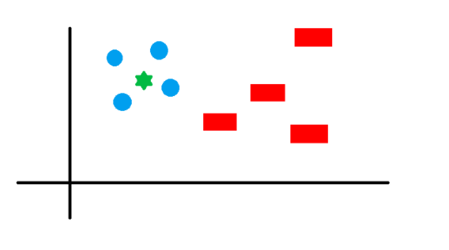
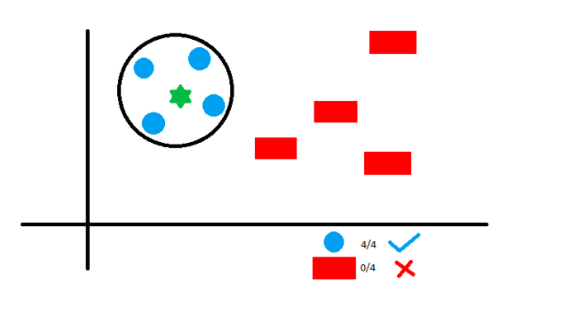

## KNN

```{r include=FALSE}
source('../src/load-data.R')
```

### Descrição e Funcionamento 

Assumindo-se que se tem vários grupos de amostras classificadas e que os itens presentes nos grupos são de natureza homogênea. Tem-se um exemplo de uma amostra que precisa de ser classificada num desses vários grupos. O algoritmo dos K vizinhos mais próximos (KNN) pode ser usado para resolver tal problema já que consiste em armazenar todos os casos disponíveis e classificar os novos casos pela maioria dos votos dos seus K vizinhos. Assim, este algoritmo consegue separar os dados sem classificação em grupos bem definidos.

É um algoritmo de classificação e regressão muito simples. No caso de classificação, novos pontos de dados são classificados em uma classe particular com base na votação dos vizinhos mais próximos. No caso da regressão, os novos dados são caraterizados com base nas médias do valor mais próximo. É um algoritmo de aprendizagem supervisionada mas não tem grande aprendizagem com os dados de treino. O método padrão é a distância euclidiana (distância mais curta entre 2 pontos) usada para variáveis contínuas, enquanto que para variáveis discretas, como para classificação de texto, a métrica de sobreposição (Distância de Hamming) é a melhor escolha.

A seguir está uma distribuição de círculos azuis (CA) e retângulos vermelhos (RV).



Pretende-se descobrir a classe da estrela verde que pode ser apenas CA ou RV. O "K" neste algoritmo é o número de vizinhos mais próximos nos quais desejamos votar. Assim, por exemplo, digamos K=4 e faremos um círculo com a estrela verda para incluir 4 pontos de dados no plano, conforme a figura seguinte:



Os 4 pontos mais próximos da estrela verde são todos CA, logo com um bom nível de confiança, pode-se afirmar que a estrela verde deve pertencer à classe CA.

Neste exemplo, a escolha tornou-se bastante óbvia porque todos os 4 votos do vizinho mais próximo foram para a classe CA, concluindo-se que a escolha do parâmetro K é muito importante neste algoritmo.

Este algoritmo tem certos requisitos específicos: É frequente decidir K tendo em conta a raiz quadrada do número de dados. Mas um K de valor elevado tem benefícios que incluem a redução da variância devido a dados ruidosos; o efeito colateral é o desenvolvimento de uma tendência para ignorar os baixos padrões que podem ter perceções úteis. Para colocar todos os dados na mesma escala (por exemplo: 0 a 1) deverá-se escalar os dados ou ocorrer a normalização, caso contrário, irá dar-se mais peso aos dados que são mais elevados em valor, independentemente da escala/unidade.

Algo bastante positivo acerca deste algoritmo que nos levou a testa-lo foi ser altamente imparcial por natureza e não fazer nenhuma suposição prévia dos dados subjacentes, sendo um dos algoritmos mais populares por ser simples, eficaz e fácil de implementar.

Por outro lado, por ser um algoritmo extremamente simples, a construção deste algoritmo requer tempo investido na preparação de dados (especialmente tratando dados nulos e categóricos) para obter um modelo robusto que é sensível a *outliers*.

### Caso de estudo: Vinho Tinto

No nosso projeto, começamos por usar o caso do vinho tinto para experimentar a abordagem do algoritmo KNN.

Em primeiro lugar repartimos os dados em dados de treino e em dados de teste usando a função *createDataPartition()* da biblioteca *caret*

```{r, include=FALSE}

set.seed(300)
##classification
red_wine$quality <- factor(red_wine$quality)


indxTrain <- createDataPartition(y = red_wine$quality,p = 0.75,list = FALSE)

training<- red_wine[indxTrain,]
testing<- red_wine[-indxTrain,]
```

A seguir verificamos a distribuição dos dados originais e dos dados repartidos, concluindo que todos os valores para cada classe são idênticos.

```{r, include=FALSE}
prop.table(table(training$quality)) * 100
```

```{r, include=FALSE}
prop.table(table(testing$quality)) * 100
```

```{r, include=FALSE}
prop.table(table(red_wine$quality)) * 100
```

Como já referido o algoritmo KNN requer que as variáveis sejam normalizadas ou escaladas. Optamos por as centralizar e escalar com métodos da biblioteca *caret*.

```{r, include=FALSE}
trainX <- training[,names(training) != "quality"]
preProcValues <- preProcess(x = trainX,method = c("center", "scale"))
preProcValues
```

A seguir optamos por treinar o modelo, não nos esquecendo de antes fazer *cross-validation* que se repetiu 10 vezes para 10 *folds*.

```{r, include=FALSE}
set.seed(400)

trControll <- trainControl(method="repeatedcv",repeats = 3)


knnfit <-train(quality ~.,
             method ="knn",
             metric="Accuracy",
             trControl = trControll,
             data = training,
             tuneLength = 20,
             preProcess = c("center","scale"))
  
knnfit
```

Podemos observar no gráfico seguinte que o melhor valor de K para este dataset é K=33 com uma acurácia de 0.5746151. 

```{r}
plot(knnfit)
```

Através da matriz de confusão podemos observar várias predições e estatísticas importantes:

Usando como exemplo o número que se encontra na linha 5 e na coluna 5, este número refere-se a 122 casos verdadeiros positivos, ou seja a 122 casos que previram um vinho de qualidade 5 e realmente aconteceu. Já o número da linha 5 e coluna 6 refere-se a 57 casos que previram um vinho de qualidade 5 mas o resultado é um vinho de qualidade 6, tornando-se um falso positivo (relativo a 5). Já na linha 6, coluna 5 o número 47 é um falso negativo porque não se preveu 5 (preveu-se 6) mas o resultado foi 5.

Também é confirmado que a precisão do modelo é 0.5894, podendo-se verificar a *sensitivity* e a *specifity* de cada classe e observar que para a qualidade 5 e 6 do vinho tinto esses valores são maiores indo de encontro com a ideia de que o dataset estava desbalanceado.

```{r}
knnPredict <- predict(knnfit,newdata = testing )
confusionMatrix(knnPredict, testing$quality)
```

### Caso de estudo: Vinho Branco

Experimentemos a abordagem do algoritmo KNN com o vinho branco agora. Todos os procedimentos foram os mesmos que para o vinho tinto com resultados obtidos ligeiramente diferentes.

```{r, include=FALSE}
# To get the same random sample

set.seed(300)

white_wine$quality <- factor(white_wine$quality)

#Spliting data as training and test set. Using createDataPartition() function from caret
indxTrain_white_wine <- createDataPartition(y = white_wine$quality,p = 0.75,list = FALSE)

training_white_wine<- white_wine[indxTrain_white_wine,]
testing_white_wine<- white_wine[-indxTrain_white_wine,]

#Checking distibution in original data and partitioned data
```

Fazemos a distribuição dos dados originais e dos dados repartidos, mas desta vez para o vinho branco, concluindo que todos os valores para cada classe são idênticos.

```{r, include=FALSE}
prop.table(table(training_white_wine$quality)) * 100
```

```{r, include=FALSE}
prop.table(table(testing_white_wine$quality)) * 100
```

```{r, include=FALSE}
prop.table(table(white_wine$quality)) * 100
```

```{r, include=FALSE}
trainX_white_wine <- training_white_wine[,names(training_white_wine) != "quality"]
preProcValues_white_wine <- preProcess(x = trainX_white_wine,method = c("center", "scale"))
preProcValues_white_wine
```

```{r,include=FALSE}
set.seed(400)

trControll_white_wine <- trainControl(method="repeatedcv",repeats = 3)


knnfit_white_wine <-train( quality ~.,
             method ="knn",
             metric="Accuracy",
             trControl = trControll_white_wine,
             data = training_white_wine,
              tuneLength = 20,
             preProcess = c("center","scale"))
```

Após treinarmos o modelo de igual forma a como se sucedeu com o vinho tinto:

```{r, include=FALSE}
knnfit_white_wine
```

Pelo gráfico seguinte podemos concluir que o melhor valor de K para este
_dataset_ é K=25 com uma precisão de 0.5470733.

```{r}
plot(knnfit_white_wine)
```

Tal e qual como ocorria no vinho tinto, através da matriz de confusão podemos observar várias predições e estatísticas importantes:

Usando como exemplo o número que se encontra na linha 5 e na coluna 5, este número refere-se a 208 casos verdadeiros positivos, ou seja a 122 casos que previram um vinho de qualidade 5 e realmente aconteceu. Já o número da linha 5 e coluna 6 refere-se a 120 casos que previram um vinho de qualidade 5 mas o resultado é um vinho de qualidade 6, tornando-se um falso positivo (relativo a 5). Já na linha 6, coluna 5 o número 148 é um falso negativo porque não se preveu 5 (preveu-se 6) mas o resultado foi 5.

Também é confirmado que a precisão do modelo é 0.5556. 

```{r}
knnPredict_white_wine <- predict(knnfit_white_wine,newdata = testing_white_wine )

confusionMatrix(knnPredict_white_wine, testing_white_wine$quality)
```

### Conclusões

Com este algoritmo, comprovou-se mais uma vez que os dados do _dataset_ tinham
uma distribuição fraca, sendo a precisão no vinho tinto de 0.5894 e no vinho branco
de 0.5556. Estes valores vão de encontro com os resultados observados nos outros
algoritmos, mostrando que apesar de haver bastantes verdadeiros positivos e
falsos negativos, existe um grande número de falsos positivos e verdadeiros
negativos ao treinar e testar este modelo.


