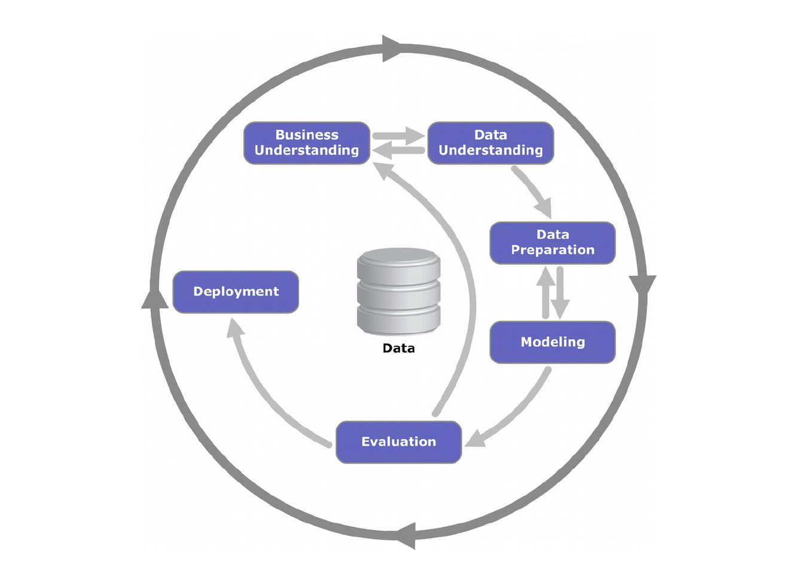

# Metodologia

Ao longo deste trabalho foi utilizada a metodologia CRISP-DM, a qual visa
transmitir os diferentes passos associados a um problema de modelação de
dados. Os principais aspectos considerados neste estudo foram:

- **Compreensão de negócio** - Perceber como funciona o negócio em questão e
de que forma os atributos podem ser utilizados a nosso favor.
- **Compreensão dos dados** - Analisar possíveis relações entre os
diferentres atributos, bem como cada um dos atributos de forma geral.
Perceber o comportamento dos dados utilizados.
- **Preparação dos Dados** - Ao contrário dos aspectos acima, este passo não
pode ser bem definido, pois é avaliado ao longo do desenvolvimento de um
modelo especifico. Adequando os atributos ao respectivo modelo, de forma a
perceber o que funciona melhor em cada casa.
- **Modelação** - Aqui tentamos utilizar os diferentes modelos ao nosso
dispor e avaliar qual é o mais adequado no contexto em que estamos inseridos.
Neste estudo abordamos os modelos: Regressão Logística, LDA, QDA, K-Nearest
Neighbours.
- **Avaliação** - Para além dos diferentes modelos, é necessário uma boa
forma de os avaliar. O *cross validation* é o método de seleção para a
avaliação da qualidade do modelo.

{width=10cm}

Claro que, todo este funcionamento é iterativo e, por vezes, pode ser
necessário voltar atrás e tomar um conjunto de decisões diferentes que
permitam obter um melhor resultado.
